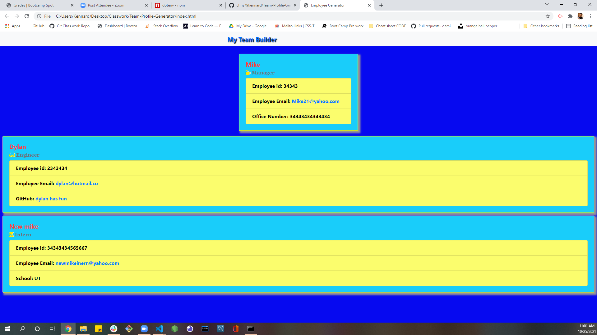

# Team-Profile-Generator

## this is for employer's who would like to be able to quickly add a member to team and be able to enter the employee's credentials all from one secure location with out having to use the web if not wanted but its still a option after entering the user info from the terminal.

## Languages / Systems used to complete this assignment

1. JavaScript
2. HTML
3. CSS
4. Git
5. Jquery
6. BootStrap
7. Node
8. NPM

# screen shots

# links

- [repository](https://github.com/chris79kennard/Weather-Dash-Board-)
